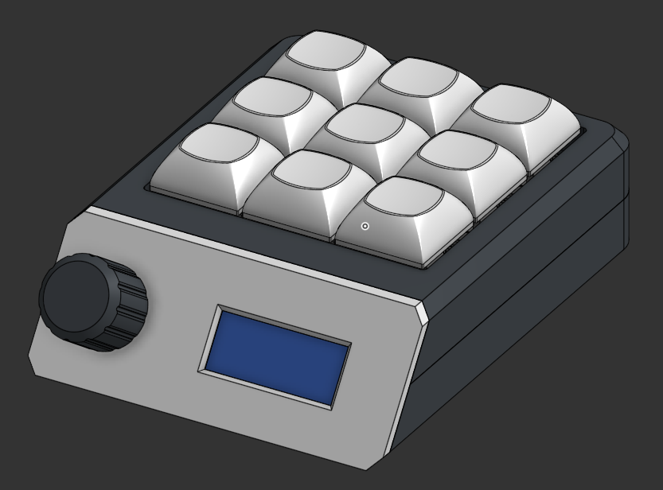
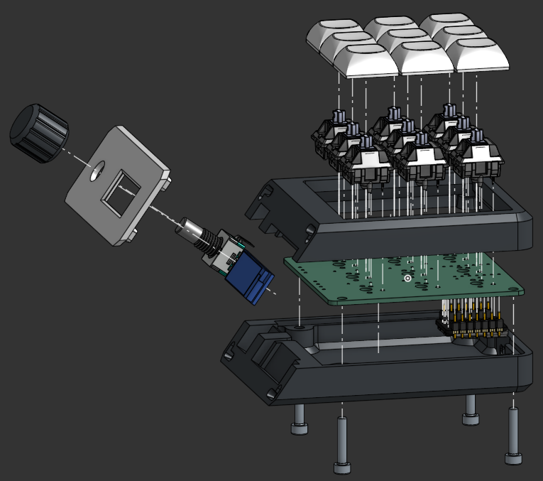
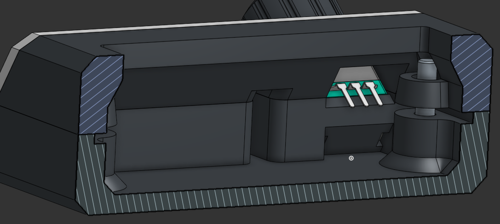
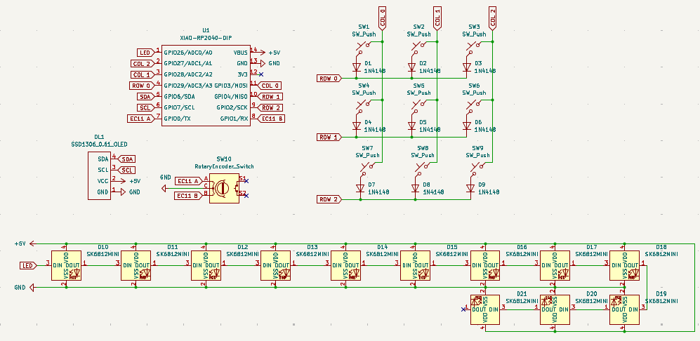
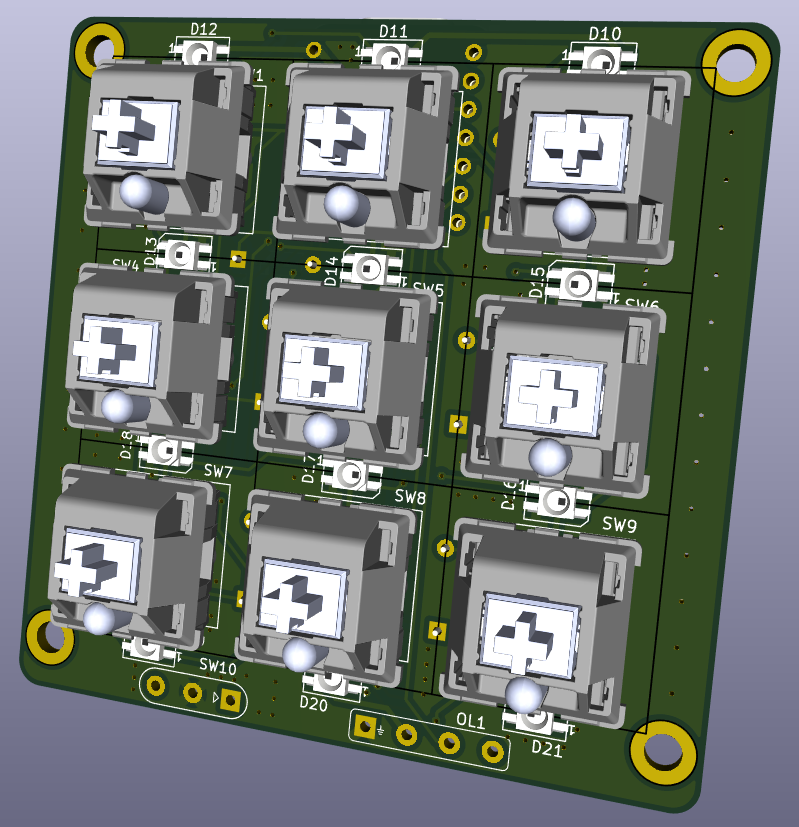
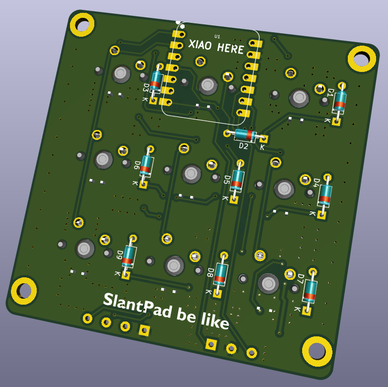
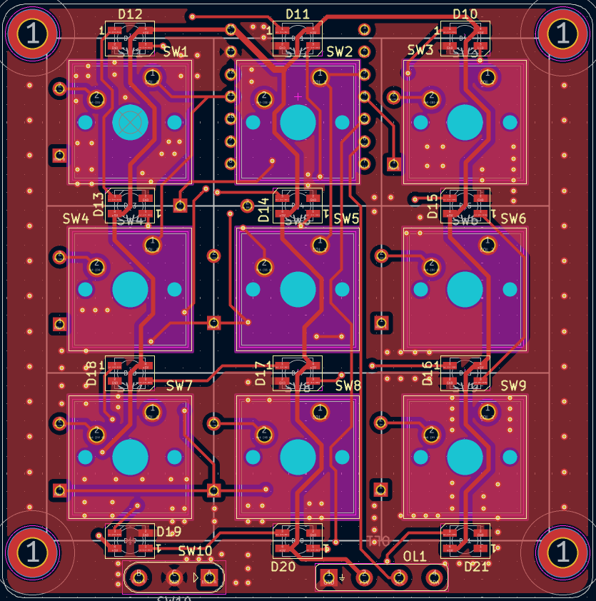
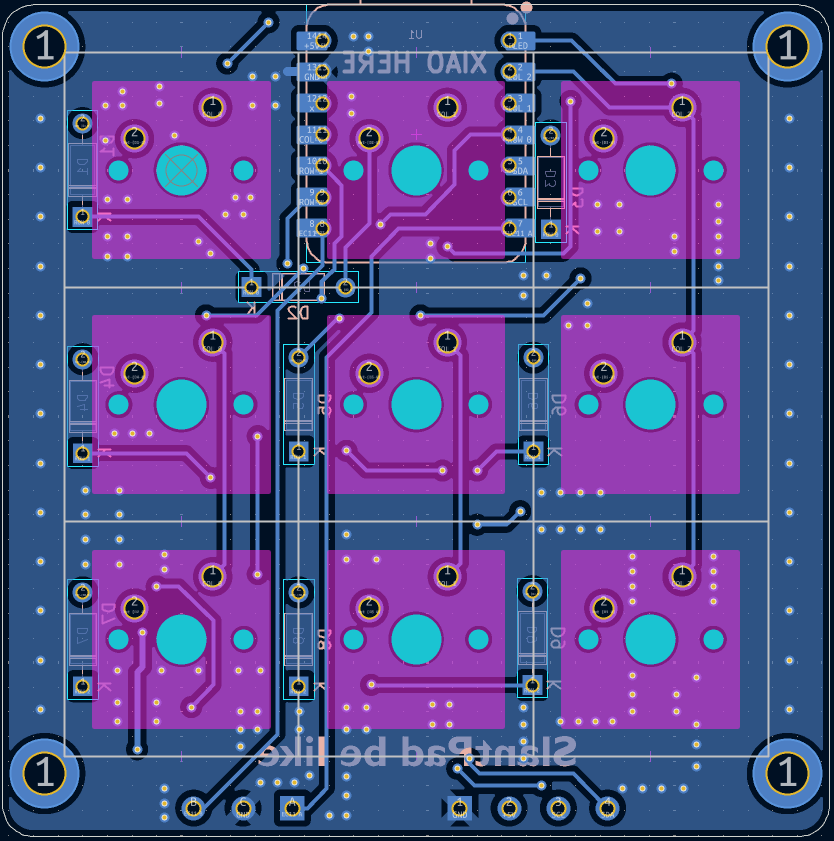

# SlantPad
So this is a really interesting looking macropad that I will primarily be using to CAD on Onshape.

The most distinctive feature is that the OLED and rotary encoder are mounted on the front at an angle
and will be attached to the PCB by soldering wires from the PCB to the components.

**Note:** I took heavy inspiration from Sam Liu's [SquarePad](https://github.com/samdev-7/squarepad/tree/main).

## CAD
The case was modeled in Onshape and can be viewed [here](https://cad.onshape.com/documents/7421df7f1bb1a5a27283fec0/w/9a583cf50c19ed7cba38c083/e/84af72cc664b6b6948a7a570).

  

Behind the front cover of the case, there are slots in both the bottom and top parts that allow the rotary encoder
and screen to fit.

There are 2 holes on the sides of the slot for the EC11, this so that the mounting pins on the
EC11 can be pushed in and it can be snapped into place. There are 2 other pins on the EC11 for the onboard
button, but I will be cutting those off because I am not using them.

There is a deeper rectanglular slot in the slot for the OLED, and this is so that the components on the back of the
OLED's PCB can fit. A channel on the side of the OLED slot leading to the main chamber of the case will allow wires to
go through from the OLED to the main PCB.

  

*The L shaped slots in the corners have corresponding protrusions in the front cover that make it easier to line up and
glue the front cover on*

***Why I am permanently mounting the front cover on:** I couldn't figure out how to screw the front cover on bc
heatset inserts take up a lot of space and there's like no space at the front and I havent made a
snap fit 3D print before and I thought that now is **not** the time to mess with clearances.*

  

Also, I will probably be bending 3 main pins of the EC11 with pliers so they fit better in the case.

## PCB
Unfortunately I can't make a clean pcb for my life and I couldn't figure out how to connect everything without
excessively spamming vias and then via stitching the ground planes together on top of that.

  

   

*The XIAO RP2040 will be soldered to the back with header pins on.*

   

## BOM
* 1x SEEED XIAO RP2040
* 9x Cherry MX Switches
* 9x DSA Keycaps
* 9x 1N4148 THT Diodes
* 12x SK6812 MINI-E LEDs
* 1x EC11 Rotary Encoder
* 1x 0.91" OLED Display
* 4x M3x16mm screws
* 4x M3x5mmx4mm heatset inserts
* 1x Case (3x 3D printed parts)
* 1x Knob (3D printed)
* wires (i will source those myself)